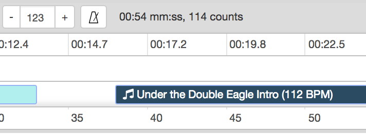
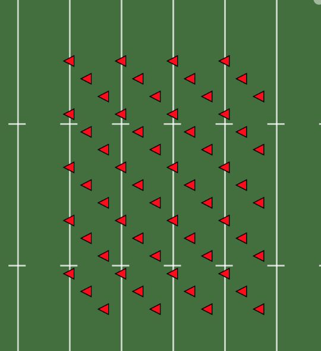

#### Version 0.3.7 - 8/2/18

**FIX**: File Detection - Followers will be detected up to 8 steps from their leader (previously 6 steps).  Gaps larger than 8 steps will be treated as a new file.

**NEW**: The timeline now shows the time in minutes and seconds (mm:ss) along the top, and the count along the bottom.  In addition, the toolbar above the timeline now displays the length of the drill in mm:ss and counts. The times are re-calculated to take music and tempo changes in to account.

**NEW**: **Fast Break** maneuver.  Ranks are typically 6 steps apart when applying this maneuver.  Group A continues forward, Group B marks time two counts, and Group C backs up two counts.  The A/B/C groups can start from the left or right guide.  Apply it again in the opposite direction to undo.

**NEW**: You can now **Add Music** from the right-click menu on the timeline.

**NEW**: Keyboard Shortcut - You can start and stop drill playback by tapping the space bar.

-------

#### Version 0.3.6 - 7/30/18

**NEW**: The **Step-Two** maneuver makes it easier add delayed step offs.

* The band can start from a Halt or from Mark-Time.
* Files can be delayed by a given number of counts (defaults to 2), and the delay can start from the left or right guide.
* Ranks can also be delayed starting from the front or back rank.

**NEW**: **Waterfall** maneuver

* The file delay is configurable.  Defaults to 6 counts.
* The "depth" of the waterfall - how far each file proceeds after the initial turn - is configurable.  Defaults to 6 counts.
* The maneuver can be repeated a specified number of times.

**NEW**: **Squirrel Cage** maneuver.  Each "ring" in the selected block will rotate around the block for a given number of counts.

* Clockwise or counter-clockwise rotation
* Alternate the direction of each "ring"

**FIX**: Sped up searches in the Open Drill dialog. Frequent searches were also putting too much load on the database.

**FIX**: Files were not detected when the band was halted or marking time, preventing the Path tool and Maneuvers from working.  This now works, but the band must be in a reasonably clean block.

**FIX**: In a few cases, file indicators were drawn incorrectly when at the beginning of the drill.

-------

#### Version 0.3.5

**FIX**: Starting playback in the middle of a split audio track started on wrong beat.

**FIX**: To-the-rears window now remembers previous settings.

-------

#### Version 0.3.4

**FIX**: Fixed a bug that prevented Save As from working when Bookmarks existed in the drill.

**NEW**: The *To-The-Rears* tool allows you to quickly add to-the-rear based maneuvers.  You can delay files left-to-right or right-to-left, and ranks front-to-back or back-to-front.

