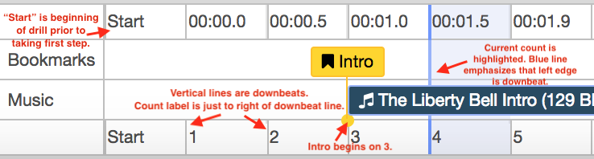
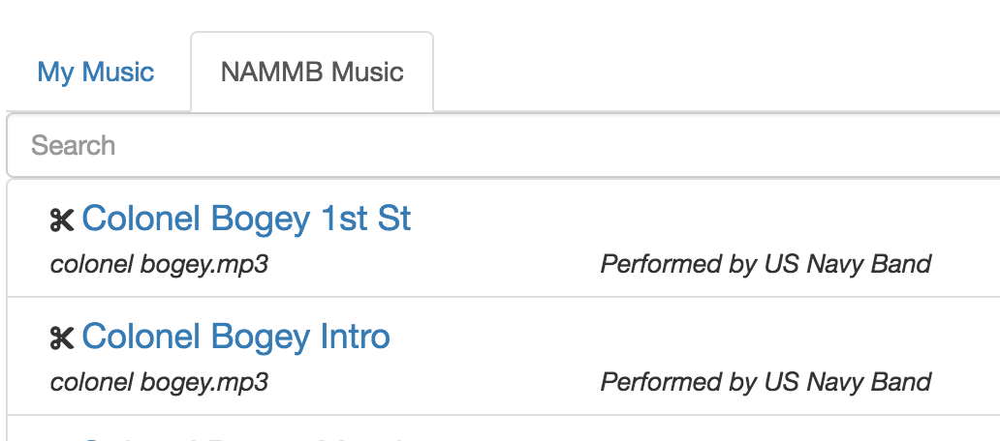

#### Version 0.3.16 - 6/23/19

**FIX**: Fixes to Delete and Clear step buttons. You can now undo these actions.

#### Version 0.3.15 - 6/23/19

**FIX**: Fixed Insert Step button. A bug was introduced in v0.3.14 that caused incorrect behavior when inserting steps immediatey before a turn.

#### Version 0.3.14 - 9/15/18

**NEW**: **Insert Halt / Mark Time...** option on the right-click menu. This option will let you specify how many counts of halt or mark time.  The band will then continue with any actions that were there prior to inserting the halt.

The inserted halt / mark time steps can be undone via the Undo menu.

NOTE: This feature is experimental and may move to the Steps menu in the future.

-------

#### Version 0.3.13 - 9/12/18

**FIX**: A few minor chart updates:

  * Long titles will wrap
  * Spacing and placement of field and color legend

-------

#### Version 0.3.12 - 9/11/18

**NEW**: Formatting changes to the timeline to make it clearer which count is the current count.

**NEW**: When showing the grid on the field, lines on every 2 paces are accented slightly.

**NEW**: **Print Grid** option to show the grid when printing charts.

**FIX**: The color legend on charts showed wrong colors for a few instruments. Fixed.

-------

#### Version 0.3.11 - 8/30/18

**NEW**: The **Choose Music** dialog now has two tabs:  **My Music** and **NAMMB Music**.  Music that you have uploaded, as well as any clips that you have saved, will be found under My Music.  

Music in the **NAMMB Music** library can be used by all users.  Only the administrator can add music to the NAMMB library.  However, users can create clips from music in the NAMMB library and save them to their personal library.

-------

#### Version 0.3.10 - 8/27/18

**NEW**: Show an instruments legend when printing charts in color.

**FIX**: Delete Track on right-click menu was not working.  Fixed.

**FIX**: Added a scrollbar to the bookmarks menu.  When there were a lot of bookmarks, the menu was sometimes too large to fit on screen.

**FIX**: Added a note about pop-up blockers on the Print Charts dialog box.  Pop-up blockers may prevent the application from opening the chart in a new browser tab. You may need to add an exception to your pop-up blocker, disable it, or hold the Ctrl key to bypass it when printing charts.

-------

#### Version 0.3.9 - 8/27/18
I ran in to a few technical problems while attempting to release v0.3.9, resulting in a couple hours of down time.  I apologize if this inconvenienced anyone.

-------

#### Version 0.3.8 - 8/12/18

**NEW**: You can now **Undo** actions added via the Paths tool. 

**FIX**: Music is now sorted alphabetically.

**FIX**: Charts were showing forecasted paths even when "Counts to forecast" was zero.  This is now fixed.

**FIX**: The Path tool was not working in Block mode.  This is fixed.

**FIX**: More accurate sizing and placement of the yard line numbers.  This may need more tweaking.

**FIX**: Using the space bar to tap out counts in audio dialog was causing drill to start playing in the background.  Fixed.

